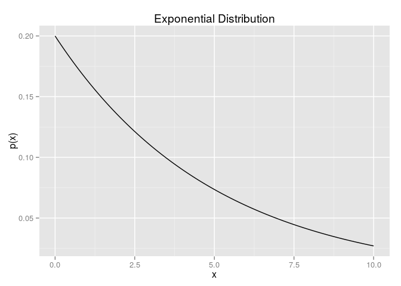
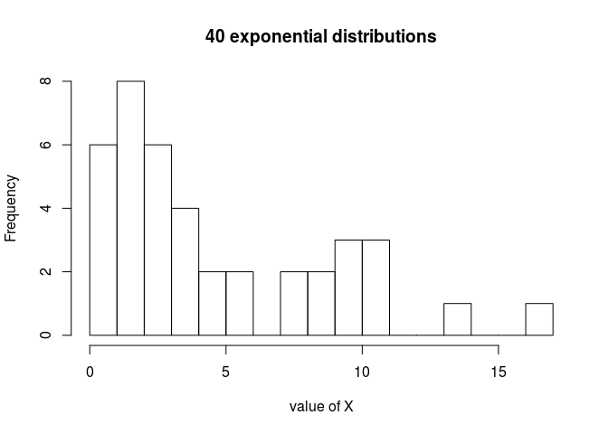

# Statistical Inference Simulation (W3: Course Project 1)
RigelFive  
02/20/2015  
## Synopsis/Overview
This analysis provides a comparison of the exponential distribution to the central limit theorem.  A simulatino of 40 random samples of the exponential distribution was performed.  The mean of the samples converges to 1/lambda, and the exponential distribution simulations showed a standard deviation value that converges to the CLT value defined by the equation sigma/sqrt(n).

## Simulations: 
Intiial parameters were established to utilize the exponential distribution.

```r
#In this project you will investigate the exponential distribution in R and compare it with the Central Limit Theorem. The exponential distribution can be simulated in R with rexp(n, lambda) where lambda is the rate parameter. The mean of exponential distribution is 1/lambda and the standard deviation is also 1/lambda. Set lambda = 0.2 for all of the simulations. You will investigate the distribution of averages of 40 exponentials. Note that you will need to do a thousand simulations.
library(ggplot2)
lambda <- 0.2
n <- 40
nosim <- 1000
distExp = NULL
mean_exp <- 1/lambda
sd_exp <- 1/lambda
```

The exponential distribution was simply generated using values along the x axis from 0 thru 10.  For this plot, lambda was defined to be 0.2

```r
# The exponential distribution
x <- seq(0.0,10.0,0.01)
p <- function(x,lambda) lambda*exp(-lambda*x)
exp_prob <- p(x,0.2)
dat <- data.frame(x, exp_prob)
qplot(x,exp_prob,data=dat,geom="line",xlab="x", ylab="p(x)",main="Exponential Distribution")
```

 

A histogram is shown below with 40 random samples taken of the exponential distribution.

```r
# The average of 40 exponential distrubtions with lambda = 0.2
distExp <- rexp(n,lambda)
hist(distExp, main="40 exponential distributions", xlab="value of X", breaks=20)
```

 

The mean value of 40 random samples of the exponential distribution is roughly near the expected value of 1/lambda (which is equal to 5 for a value of 0.2).  The standard deviation is also roughly equivalent to the value predicted by the exponential distribution value of 1/lambda

```r
print(mean(distExp))
```

```
## [1] 4.618711
```

```r
print(sd(distExp))
```

```
## [1] 4.097471
```

```r
print(1/lambda)
```

```
## [1] 5
```

A simulation was performed with 1000 runs of 40 random samples taken from the exponential distribution.

```r
# Simulation of 1000 runs of 40 exponontial distributions
distExp_sim <- NULL
for (i in 1 : nosim) distExp_sim = c(distExp_sim, mean(rexp(n,lambda)))
```

## Sample Mean versus Theoretical Mean: 
With over 1000 simulations performed, sample mean of the simulated exponential distributions approaches the value of 1/lambda.

```r
# mean of 1000 simulated exponential distributions
print(mean(distExp_sim))
```

```
## [1] 5.051124
```

```r
# predicted value using the central limit theorem (CLT) = 1/lambda
print(1/lambda)
```

```
## [1] 5
```

## Sample Variance versus Theoretical Variance: 
The sample variance of the simulated exponenital distributions becomes narrower and converges to the theoretical central limit theorem (CLT) values.

```r
# Standard variance of the simulated exponential distributions
print(sd(distExp_sim))
```

```
## [1] 0.8007799
```

```r
# The theoretical central limit theorem value for variance is predicted by using the equation sigma/sqrt(n) where n=40, and sigma is 1/lambda for the exponential distribution
CLT_sd <- (1/lambda)/sqrt(40)
print(CLT_sd)
```

```
## [1] 0.7905694
```

# Distribution
As can be shown in this plot, the simulation of 1000 runs of 40 random samples of the exponential distribution follows a normal distribution.  The distribution clearly following a normal distribution.  These results conform to the central limit theorem (CLT), which enables the use of the sample mean and sample variance to be predicted.  As shown, the mean of this simulation aligns approximately to the predicted value defined by 1/lambda.

```r
hist(as.numeric(distExp_sim),breaks=50,main="1000 runs of 40 exponential distributions",xlab="mean of exponential distribution")
mean_distExp_sim <- mean(distExp_sim)
abline(v=mean_distExp_sim, col="blue", lwd=4, lty=20)
```

 
