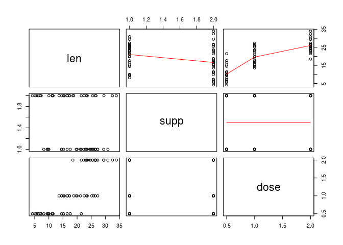
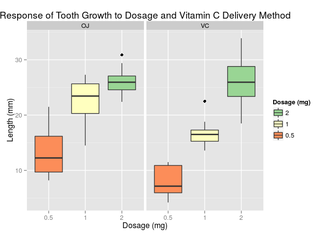

# ToothGrowth Vitamin C Data Study
RigelFive  
02/20/2015  
## Statistical Learning Course Project
## Data Science Specialization - Coursera / JHU Bloomberg School of Public Health

## Synopsis
This study performs a statistical inference on the ToothData data set provided within the R Studio software tool.  Data from the ToothGrowth data set is shown in this report.  A null hypothesis test is performed with 95% confidence intervals calculated.  The null hypothesis test is used to determine if the supply methods of Vitamin C have any difference.  The results of this study found that orange juice (OJ) has a greater effect on Guinea Pig tooth growth when delivered at 1.0 to 2.0 mg per dosage.  There was no discernible difference of Guinea pig tooth length measurements when comparing the supply methods of orange juice and ascorbic acid while delivered at a 0.5 mg dosage level.

## Raw Data
The ToothGrowth data set is a study of the effects of Vitamin C on tooth growth in guinea pigs.  The R Documentation help file provides information on this data set.  The data has three parameters:

| Parameter | Description of the parameter |
|:---------:|------------------------------|
| len       | The response value of the length of odontoblasts (teeth) |
| supp      | Delivery method of the Vitamin C by orange juice (OJ) or by ascorbic acid (VC) |
| dose      | The dosage amount of the Vitamin C with typical values of 0.5, 1.0, and 2.0 mg |

## Exploratory Data Analysis
Each of the parameters are shown in a 'pairs' plot, which shows that the variation of response to the two parameters of supply method and dosage.  

```r
library(datasets)
library(ggplot2)
data(ToothGrowth)
names(ToothGrowth)
```

```
## [1] "len"  "supp" "dose"
```

```r
pairs(ToothGrowth, upper.panel = panel.smooth)
```

 

When using a linear regression to the response variable of tooth length, the two input parameters are found to have linear trends that can be modeled with the data.

```r
fit <- lm(len ~ ., data=ToothGrowth)
summary(fit)
```

```
## 
## Call:
## lm(formula = len ~ ., data = ToothGrowth)
## 
## Residuals:
##    Min     1Q Median     3Q    Max 
## -6.600 -3.700  0.373  2.116  8.800 
## 
## Coefficients:
##             Estimate Std. Error t value Pr(>|t|)    
## (Intercept)   9.2725     1.2824   7.231 1.31e-09 ***
## suppVC       -3.7000     1.0936  -3.383   0.0013 ** 
## dose          9.7636     0.8768  11.135 6.31e-16 ***
## ---
## Signif. codes:  0 '***' 0.001 '**' 0.01 '*' 0.05 '.' 0.1 ' ' 1
## 
## Residual standard error: 4.236 on 57 degrees of freedom
## Multiple R-squared:  0.7038,	Adjusted R-squared:  0.6934 
## F-statistic: 67.72 on 2 and 57 DF,  p-value: 8.716e-16
```

A plot of the response variable len is shown with the input of dosage and colored for the two types of supply methods for the vitamin C.  


```r
ggplot(ToothGrowth, aes(x=factor(dose), y=len, fill=factor(dose))) + 
  geom_boxplot() + 
  scale_fill_brewer(palette="Spectral", name="Dosage (mg)") +
  guides(fill = guide_legend(reverse=TRUE)) +
  xlab("Dosage (mg)") +
  ylab("Length (mm)") +
  facet_grid(.~supp) + 
  ggtitle("Response of Tooth Growth to Dosage and Vitamin C Delivery Method")
```

 

## Confidence Intervals/Tests
Were the results of the tests and/or intervals interpreted in the context of the problem correctly? 

The null hypothesis condition is that there is no difference between the two supply methods that contributes to Guinea pig tooth growth.  The alternate hypothesis is that the delivery method (orange juice or ascorbic acid) does have a difference in the tooth length response.  These hypothesis tests are performed using the t.test function with the length (len) vs supply method (supp) variables.


```r
data_half<-subset(ToothGrowth, dose==0.5)
data_one<-subset(ToothGrowth, dose==1)
data_two<-subset(ToothGrowth, dose==2)
                
t.test(len ~ supp, data=ToothGrowth, paired = TRUE) # Null hypothesis test for entire data set
```

```
## 
## 	Paired t-test
## 
## data:  len by supp
## t = 3.3026, df = 29, p-value = 0.00255
## alternative hypothesis: true difference in means is not equal to 0
## 95 percent confidence interval:
##  1.408659 5.991341
## sample estimates:
## mean of the differences 
##                     3.7
```

```r
t.test(len ~ supp, data=data_half, paired = TRUE) # Null hypothesis test for 0.5 mg dosage 
```

```
## 
## 	Paired t-test
## 
## data:  len by supp
## t = 2.9791, df = 9, p-value = 0.01547
## alternative hypothesis: true difference in means is not equal to 0
## 95 percent confidence interval:
##  1.263458 9.236542
## sample estimates:
## mean of the differences 
##                    5.25
```

```r
t.test(len ~ supp, data=data_one, paired = TRUE) # Null hypothesis test for 1.0 mg dosage
```

```
## 
## 	Paired t-test
## 
## data:  len by supp
## t = 3.3721, df = 9, p-value = 0.008229
## alternative hypothesis: true difference in means is not equal to 0
## 95 percent confidence interval:
##  1.951911 9.908089
## sample estimates:
## mean of the differences 
##                    5.93
```

```r
t.test(len ~ supp, data=data_two, paired = TRUE) # Null hypothesis test for 2.0 mg dosage
```

```
## 
## 	Paired t-test
## 
## data:  len by supp
## t = -0.0426, df = 9, p-value = 0.967
## alternative hypothesis: true difference in means is not equal to 0
## 95 percent confidence interval:
##  -4.328976  4.168976
## sample estimates:
## mean of the differences 
##                   -0.08
```

## Discussion
For the full data set, it was clear that there is an overall difference and that orange juice has a stronger effect to promote longer Guinea pig tooth length.  

For the dosage levels of 1.0 and 2.0 mg, there was a clear test to reject the null hypothesis.  This suggests that orange juice has a stronger contribution to tooth growth over ascorbic acid.  

The dosage of 0.5 mg had a mean value of the differences that was below 0 and suggests that the null hypothesis is NOT to be rejected.  This suggests that there are no observed difference in tooth growth between supply methods of orange juice and ascorbic acid at low dosage levels of 0.5 mg.

## Assumptions
The primary assumption in this analysis is that tooth growth was measured at a specified length of time during the study.  In other words, if the testing occurred at variable lengths of time that were not standardized, the growth of the teeth may have been simply due to natural growth.  

## Conclusions
Student's t-tests were performed on the data set to determine the effects of Vitamin C on Guinea pig tooth length.  The results of this study found that orange juice (OJ) has a greater effect on Guinea Pig tooth growth when delivered at 1.0 to 2.0 mg per dosage.  There was no discernible difference of Guinea pig tooth length measurements when comparing the supply methods of orange juice and ascorbic acid while delivered at a 0.5 mg dosage level.
